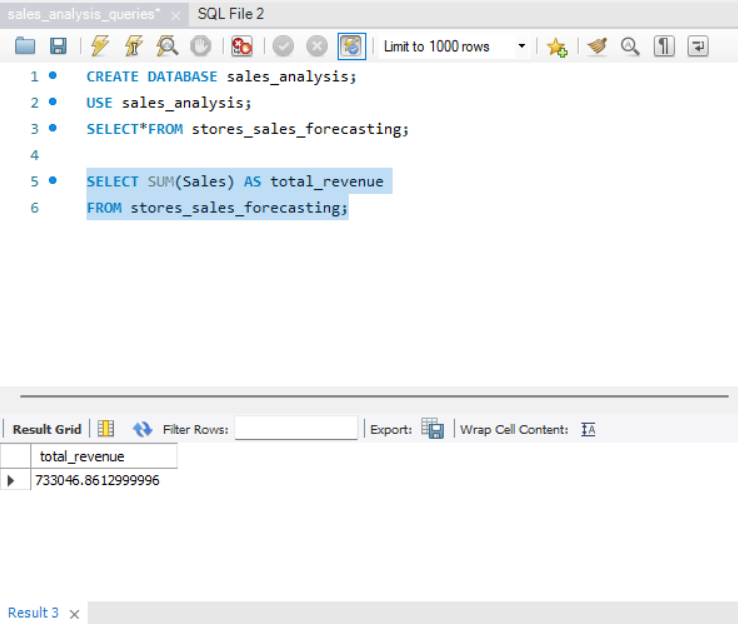

# SQL Retail Sales Analysis

## Objective
Analyze retail sales data to identify revenue trends, top customers, and product performance.

## Dataset
Retail sales transaction dataset containing:
- order_id
- customer_id
- category
- quantity
- price
- sale_date

## Business Questions
1. What is the total revenue?
2. Which product categories generate the most revenue?
3. Who are the top customers by spending?
4. What are the monthly sales trends?
5. Which time of day generates the most sales?

## Key SQL Concepts Used
- GROUP BY
- JOIN
- Aggregate Functions
- Filtering
- Ordering

## Example Query

SELECT category, SUM(total_sale) AS revenue
FROM retail_sales
GROUP BY category
ORDER BY revenue DESC;

## Key Insights

- Identified top spending customers
- Calculated revenue share by product
- Analyzed average order value
- Performed customer revenue ranking

## Total Revenue Analysis

Query calculates total sales revenue from the dataset.

